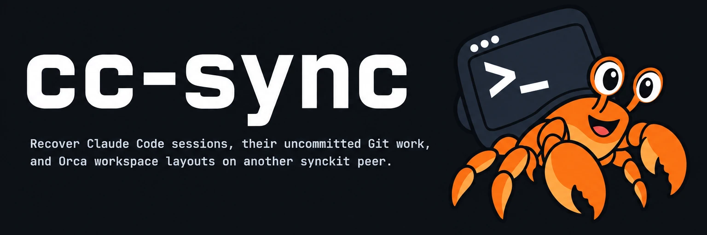

# 

**Recover Claude Code sessions, their uncommitted Git work, and Orca workspace layouts on another synckit peer.** Only the `hello` greeting works today; recovery is not implemented.

[](https://github.com/yasyf/cc-sync/releases)
[](https://github.com/yasyf/cc-sync/actions/workflows/ci.yml)
[](https://github.com/yasyf/cc-sync/blob/main/LICENSE)

## Get started

Requires Go 1.26 or newer. Put the directory from `go env GOBIN` first on your `PATH`;
when that setting is empty, use `$(go env GOPATH)/bin`. Install and print a greeting:

```bash
go install github.com/yasyf/cc-sync/cmd/cc-sync@latest
cc-sync hello
```


Driving with an agent? Paste this:

```text
Install cc-sync with `go install github.com/yasyf/cc-sync/cmd/cc-sync@latest`,
then run `cc-sync hello` and confirm it prints `Hello from cc-sync!`.
Docs: https://github.com/yasyf/cc-sync#readme
```

---

Status: Command skeleton; no session, Git, or Orca recovery.

Licensed under [PolyForm-Noncommercial-1.0.0](LICENSE).
